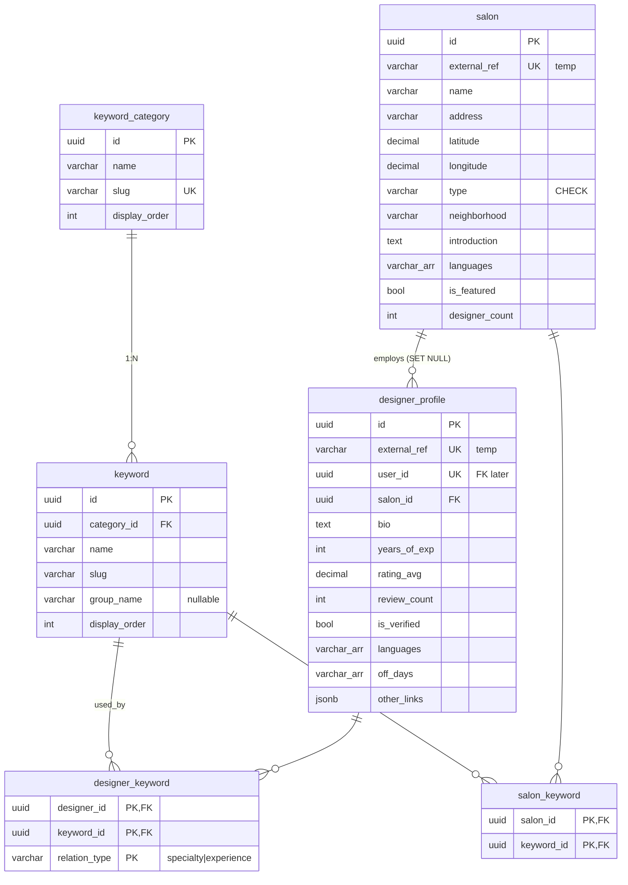

# Curling DB — 현재 구조 스냅샷

> **Source**: `supabase/migrations/20260421000001~5_*.sql` + `20260424000001~2_*.sql`
> **Scope**: Phase 1 (5개 테이블) + designer-detail PDCA (designer_profile 컬럼 확장)
> **Status**: 마이그레이션 적용 완료 · 시드 후 임시 컬럼 DROP 대기 · Auth 전 계층 분리 예정 (§7)

---

## 1. 한눈에 보기

```
         ┌──────────────────┐
         │ keyword_category │   (9개 카테고리: Hair Type, Treatment, ...)
         └────────┬─────────┘
                  │ 1:N
                  ▼
         ┌──────────────────┐
         │     keyword      │   (필터 칩 마스터)
         └────────┬─────────┘
                  │
        ┌─────────┴─────────┐
        │ N:M               │ N:M
        ▼                   ▼
┌───────────────┐   ┌──────────────────┐
│ salon_keyword │   │ designer_keyword │ (relation_type: specialty | experience)
└───────┬───────┘   └────────┬─────────┘
        │                    │
        ▼                    ▼
   ┌─────────┐        ┌───────────────────┐
   │  salon  │◀───────│ designer_profile  │
   └─────────┘ 1:N    └───────────────────┘
```

---

## 2. 테이블 상세

### 2.1 `salon`

살롱 기본 정보 + 지도/지역 검색 인덱스.

| 컬럼 | 타입 | 비고 |
|---|---|---|
| `id` | UUID PK | `gen_random_uuid()` |
| `external_ref` | VARCHAR(10) UNIQUE | Mock `_ref` (S001 등) · 시드 후 DROP |
| `name` | VARCHAR(200) NOT NULL | |
| `address` | VARCHAR(500) NOT NULL | |
| `latitude` / `longitude` | DECIMAL(10,7) NOT NULL | |
| `phone` | VARCHAR(20) | |
| `type` | VARCHAR(20) | CHECK: `salon | barber | specialty | independent` |
| `neighborhood` | VARCHAR(50) | |
| `introduction` | TEXT | |
| `languages` | VARCHAR(20)[] | 기본 `[]`. 대응 가능 언어 |
| `is_featured` | BOOLEAN | 기본 false |
| `designer_count` | INT | 시드 후 COUNT로 재집계 |
| `created_at` | TIMESTAMPTZ | |

**Indexes**
- `idx_salon_lat_lng` (latitude, longitude)
- `idx_salon_type` (type)
- `idx_salon_neighborhood` (neighborhood)

**TODO**: 반경 검색 필요 시 PostGIS + `geography` 컬럼 + GiST 인덱스로 전환.

---

### 2.2 `keyword_category`

FilterPopup 9개 섹션의 마스터.

| 컬럼 | 타입 | 비고 |
|---|---|---|
| `id` | UUID PK | |
| `name` | VARCHAR(50) NOT NULL | 표시용 (예: "Hair Type") |
| `slug` | VARCHAR(50) UNIQUE NOT NULL | 코드용 (예: `hair_type`) |
| `display_order` | INT | FilterPopup 정렬 |
| `created_at` | TIMESTAMPTZ | |

**시드된 9개 슬러그**: `hair_type`, `treatment`, `style`, `hair_concern`, `languages`, `special_offers`, `hair_color`, `hair_length`, `treatment_history`.

---

### 2.3 `keyword`

각 카테고리 안의 실제 필터 칩.

| 컬럼 | 타입 | 비고 |
|---|---|---|
| `id` | UUID PK | |
| `category_id` | UUID FK → `keyword_category.id` ON DELETE CASCADE | |
| `name` | VARCHAR(100) NOT NULL | "Curly Cut" 등 |
| `slug` | VARCHAR(100) NOT NULL | |
| `group_name` | VARCHAR(30) | Treatment의 2단계 그룹(Cut/Color/Perm/Braids & Locs/Care/Barber). 불필요 시 NULL |
| `display_order` | INT | |
| `created_at` | TIMESTAMPTZ | |
| **UNIQUE** | `(category_id, slug)` | |

**Indexes**
- `idx_keyword_category` (category_id)
- `idx_keyword_group` (group_name) WHERE group_name IS NOT NULL

**현재 시드 커버리지 (44개)**
- Treatment: 21 · Style: 2 · Hair Type: 13 · Languages: 8
- `hair_concern` / `hair_color` / `hair_length` / `treatment_history` / `special_offers`는 카테고리만 생성, 키워드 시드는 이후 PDCA.

---

### 2.4 `designer_profile`

| 컬럼 | 타입 | 비고 |
|---|---|---|
| `id` | UUID PK | |
| `external_ref` | VARCHAR(10) UNIQUE | Mock `_user_ref` (U001 등) · 시드 후 DROP |
| `user_id` | UUID UNIQUE | **FK 아직 없음** · Auth PDCA 시점에 NOT NULL + FK 추가 예정 |
| `salon_id` | UUID FK → `salon.id` ON DELETE SET NULL | 프리랜서/이직 시 NULL |
| `bio` | TEXT | |
| `highlight_message` | VARCHAR(200) | |
| `years_of_exp` | INT | |
| `rating_avg` | DECIMAL(2,1) | CHECK 0 ≤ x ≤ 5, 기본 0.0 |
| `review_count` | INT | 기본 0 |
| `is_verified` | BOOLEAN | 기본 false |
| `languages` | VARCHAR(20)[] | FilterPopup Languages와 매칭 |
| `off_days` | VARCHAR(10)[] | `MON`, `TUE` 등 |
| `other_links` | JSONB | `{instagram, blog, ...}` |
| `_temp_specialties` | TEXT[] | **시드 전용** · `designer_keyword` 시드 후 DROP |
| `_temp_hair_type_experience` | TEXT[] | **시드 전용** · 동일 |
| `created_at` / `updated_at` | TIMESTAMPTZ | |

**Indexes**
- `idx_designer_salon` (salon_id)
- `idx_designer_user` (user_id)
- `idx_designer_languages` GIN (languages)

---

### 2.5 `designer_keyword` (N:M, composite PK)

디자이너 ↔ 키워드 연결. `relation_type`으로 "장점"과 "경험"을 구분한다.

| 컬럼 | 타입 | 비고 |
|---|---|---|
| `designer_id` | UUID FK → `designer_profile.id` ON DELETE CASCADE | |
| `keyword_id` | UUID FK → `keyword.id` ON DELETE CASCADE | |
| `relation_type` | VARCHAR(20) | CHECK: `specialty | experience` |
| `created_at` | TIMESTAMPTZ | |
| **PK** | `(designer_id, keyword_id, relation_type)` | 같은 키워드가 양쪽 역할로 동시 존재 가능 |

**소스 매핑**
- `designers.json._specialties[]` → `specialty`
- `designers.json._hair_type_experience[]` → `experience`

**Indexes**
- `idx_designer_keyword_keyword` (keyword_id) — 역방향 조회
- `idx_designer_keyword_relation` (relation_type)

---

### 2.6 `salon_keyword` (N:M)

살롱 **차원의 속성만** 담는다 (시설/정책 + Salon-level 서비스). 디자이너 개인 시술 스킬은 담지 않는다.

| 컬럼 | 타입 | 비고 |
|---|---|---|
| `salon_id` | UUID FK → `salon.id` ON DELETE CASCADE | |
| `keyword_id` | UUID FK → `keyword.id` ON DELETE CASCADE | |
| `created_at` | TIMESTAMPTZ | |
| **PK** | `(salon_id, keyword_id)` | |

**Indexes**
- `idx_salon_keyword_keyword` (keyword_id)

**살롱 제공 서비스 = SalonKeyword ∪ 소속 디자이너들의 DesignerKeyword 합집합** (A-2 정책).

---

## 3. ERD (Mermaid)



---

## 4. 시드 파일 요약

| 순번 | 파일 | 대상 | 비고 |
|---|---|---|---|
| 20 | `20_salons.sql` | `salon` | Mock `salons.json` |
| 30 | `30_keywords.sql` | `keyword_category` (9) + `keyword` (44) | 카테고리 전체, 키워드는 일부 |
| 40 | `40_designers.sql` | `designer_profile` | Mock `designers.json` (150명) |
| 50 | `50_designer_keywords.sql` | `designer_keyword` | `_specialties`→specialty, `_hair_type_experience`→experience |
| 60 | `60_salon_keywords.sql` | `salon_keyword` | 살롱 시설/정책 키워드만 |

시드 파일은 각각 `BEGIN; ... COMMIT;`으로 원자성을 보장하며, 마스터 데이터는 `ON CONFLICT DO NOTHING`으로 멱등.

---

## 5. 임시 컬럼 · 후속 작업

| 항목 | 위치 | 제거/보강 시점 |
|---|---|---|
| `salon.external_ref` | 컬럼 | 시드 완료 + FK 정합성 확인 후 DROP |
| `designer_profile.external_ref` | 컬럼 | 동일 |
| `designer_profile._temp_specialties` | 컬럼 | `designer_keyword` 시드 후 DROP |
| `designer_profile._temp_hair_type_experience` | 컬럼 | 동일 |
| `designer_profile.user_id` | FK 미설정 | Auth PDCA에서 NOT NULL + FK 추가 |
| `salon.designer_count` | 값 | 디자이너 시드 후 `UPDATE ... COUNT(*)`로 재집계 |
| 반경 검색 | 인덱스 | 필요 시 PostGIS + geography + GiST로 전환 |
| RLS | 정책 | Auth 구현 시점에 별도 PDCA |

---

## 6. 범위 밖 (아직 생성되지 않은 엔티티)

Phase 1 ERD에는 포함되지만 이번 커밋에서는 **마이그레이션/시드 모두 없음**:

- `user` / `app_user`
- `hair_profile`
- `portfolio`
- `article`
- `favorite`

> 위 엔티티는 ERD(`docs/01-plan/erd.md`) §3 Phase 1에 정의되어 있으나, 이번 phase1-sql PDCA에서는 DDL/시드 대상에서 제외되었다. 후속 PDCA에서 추가 예정.
